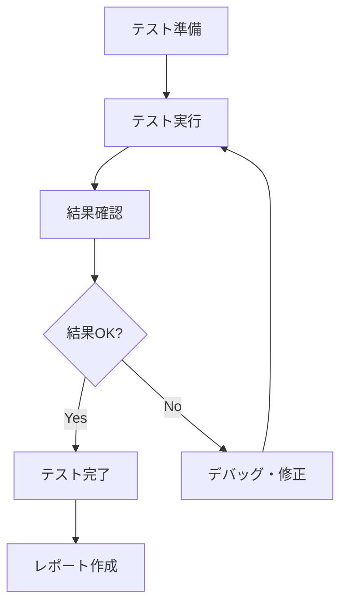

# 単体テスト手順書

## 1. 概要

### 1.1 目的
この手順書は、Saka-tec（授業スケジュール管理システム）の単体テスト実施手順を明確化し、品質の高いテストを効率的に実施するためのガイドラインを提供する。

### 1.2 適用範囲
- Vue.js 3を使用したフロントエンドアプリケーション
- IndexedDB（Dexie）を使用したデータベースサービス
- 単体テスト、統合テスト、E2Eテスト

### 1.3 前提条件
- Node.js 16.0以上がインストールされていること
- npm 7.0以上がインストールされていること
- Git環境が整っていること

## 2. テスト環境の準備

### 2.1 依存関係のインストール

```bash
# プロジェクトディレクトリに移動
cd Saka-tec

# 基本的な依存関係をインストール
npm install

# テスト用の依存関係をインストール
npm install --save-dev vitest @vue/test-utils @vitest/ui jsdom
```

### 2.2 テスト環境の設定

#### 2.2.1 Vitest設定ファイル（vitest.config.js）

```javascript
import { defineConfig } from 'vitest/config'
import vue from '@vitejs/plugin-vue'

export default defineConfig({
  plugins: [vue()],
  test: {
    environment: 'jsdom',
    globals: true,
    setupFiles: ['./test/setup.js']
  }
})
```

#### 2.2.2 テスト初期設定ファイル（test/setup.js）

```javascript
import { vi } from 'vitest'

// IndexedDBのモック
global.indexedDB = {
  open: vi.fn(),
  deleteDatabase: vi.fn(),
}

// Dexieのモック設定
vi.mock('dexie', () => { /* モック実装 */ })
```

### 2.3 ディレクトリ構造の確認

```
Saka-tec/
├── src/
│   ├── components/
│   └── services/
├── test/
│   ├── components/
│   ├── services/
│   ├── stubs/
│   ├── setup.js
│   └── test-driver.js
├── docs/
├── vitest.config.js
└── package.json
```

## 3. 単体テスト実施手順

### 3.1 テスト実施の基本フロー



### 3.2 段階的テスト実施

#### 3.2.1 Phase 1: 個別モジュールテスト

**手順1: データベースサービスのテスト**

```bash
# データベースサービスのテストを実行
npm run test -- test/services/database.test.js
```

**確認項目:**
- ✅ addClass、updateClass、deleteClassの各メソッドが正常に動作すること
- ✅ エラーハンドリングが適切に実装されていること
- ✅ データの整合性が保たれていること

**手順2: 個別コンポーネントのテスト**

```bash
# HomeScreenコンポーネントのテスト
npm run test -- test/components/HomeScreen.test.js
```

**確認項目:**
- ✅ コンポーネントが正常にマウントされること
- ✅ データバインディングが機能すること
- ✅ イベントハンドリングが正常に動作すること

#### 3.2.2 Phase 2: 統合テスト

**手順1: コンポーネント間連携テスト**

```bash
# 統合テストの実行
npm run test -- --grep "統合テスト"
```

**確認項目:**
- ✅ 画面間の遷移が正常に動作すること
- ✅ データの受け渡しが適切に行われること
- ✅ 状態管理が適切に機能すること

#### 3.2.3 Phase 3: 全体テスト

**手順1: 全テストの実行**

```bash
# 全テストを実行
npm run test
```

**手順2: カバレッジ付きテスト**

```bash
# カバレッジレポート付きでテスト実行
npm run test:coverage
```

### 3.3 テストケースの作成方法

#### 3.3.1 基本的なテストケース構造

```javascript
import { describe, it, expect, vi, beforeEach } from 'vitest'

describe('テスト対象の説明', () => {
  let testTarget
  let mockDependency

  beforeEach(() => {
    // テスト前の準備処理
    mockDependency = vi.fn()
    testTarget = new TestTarget(mockDependency)
  })

  describe('メソッド名', () => {
    it('正常系: 期待される動作の説明', async () => {
      // Arrange（準備）
      const inputData = { /* テストデータ */ }
      const expectedResult = { /* 期待値 */ }

      // Act（実行）
      const result = await testTarget.method(inputData)

      // Assert（検証）
      expect(result).toEqual(expectedResult)
      expect(mockDependency).toHaveBeenCalledWith(inputData)
    })

    it('異常系: エラーケースの説明', async () => {
      // Arrange
      const invalidData = { /* 不正なデータ */ }

      // Act & Assert
      await expect(testTarget.method(invalidData))
        .rejects.toThrow('期待されるエラーメッセージ')
    })
  })
})
```

#### 3.3.2 Vueコンポーネントのテスト

```javascript
import { mount } from '@vue/test-utils'
import Component from '@/components/Component.vue'

describe('Component', () => {
  let wrapper

  beforeEach(() => {
    wrapper = mount(Component, {
      props: { /* プロパティ */ },
      global: {
        mocks: { /* モック */ }
      }
    })
  })

  it('コンポーネントが正常に表示されること', () => {
    expect(wrapper.exists()).toBe(true)
    expect(wrapper.find('.target-element').exists()).toBe(true)
  })

  it('ユーザーインタラクションが正常に動作すること', async () => {
    const button = wrapper.find('button')
    await button.trigger('click')
    
    expect(wrapper.emitted('click')).toBeTruthy()
  })
})
```

## 4. テストデータの管理

### 4.1 テストデータの設計原則

#### 4.1.1 独立性の確保
- 各テストは他のテストに影響されないこと
- テストデータは各テストで独立して作成・破棄すること

#### 4.1.2 再現性の確保
- 同じテストは何度実行しても同じ結果になること
- 時間や環境に依存しないテストデータを使用すること

#### 4.1.3 保守性の確保
- テストデータは集約して管理すること
- 共通のテストデータは再利用可能にすること

### 4.2 テストデータの作成例

#### 4.2.1 サンプルデータファイル（test/fixtures/sample-data.js）

```javascript
export const sampleClasses = [
  {
    id: 1,
    name: '数学',
    room: '101',
    day: 0,
    period: 1,
    color: 'blue',
    teacher: '田中先生',
    note: 'テスト用授業'
  },
  {
    id: 2,
    name: '英語',
    room: '102',
    day: 1,
    period: 2,
    color: 'green',
    teacher: '佐藤先生',
    note: 'テスト用授業'
  }
]

export const sampleScheduleData = {
  'mon-1': {
    id: 1,
    name: '数学',
    room: '101',
    color: 'blue',
    teacher: '田中先生',
    note: ''
  }
}
```

#### 4.2.2 テストデータ生成ヘルパー

```javascript
export class TestDataGenerator {
  static createClass(overrides = {}) {
    return {
      id: Math.floor(Math.random() * 1000),
      name: 'テスト授業',
      room: '101',
      day: 0,
      period: 1,
      color: 'blue',
      teacher: 'テスト先生',
      note: 'テスト用ノート',
      ...overrides
    }
  }

  static createMultipleClasses(count = 5) {
    return Array.from({ length: count }, (_, i) => 
      this.createClass({ id: i + 1, name: `テスト授業${i + 1}` })
    )
  }
}
```

## 5. モックとスタブの活用

### 5.1 モック・スタブの使い分け

| 用途 | モック | スタブ |
|------|--------|--------|
| **目的** | 呼び出し確認 | 戻り値の制御 |
| **使用場面** | 副作用の確認 | 外部依存の排除 |
| **実装例** | `vi.fn()` | 固定値を返す関数 |

### 5.2 スタブの実装例

#### 5.2.1 データベーススタブ

```javascript
export class DatabaseStub {
  constructor() {
    this.data = new Map()
    this.autoId = 1
  }

  async add(item) {
    const id = this.autoId++
    this.data.set(id, { ...item, id })
    return id
  }

  async get(id) {
    return this.data.get(id)
  }

  async delete(id) {
    return this.data.delete(id)
  }

  async clear() {
    this.data.clear()
  }
}
```

#### 5.2.2 Vue Routerスタブ

```javascript
export const createRouterStub = () => ({
  push: vi.fn().mockResolvedValue(),
  replace: vi.fn().mockResolvedValue(),
  go: vi.fn(),
  back: vi.fn(),
  currentRoute: {
    value: {
      path: '/',
      query: {},
      params: {}
    }
  }
})
```

## 6. テスト実行とレポート

### 6.1 テスト実行コマンド

| コマンド | 説明 | 使用場面 |
|----------|------|----------|
| `npm test` | 全テスト実行 | リリース前の最終確認 |
| `npm run test:watch` | ウォッチモード | 開発中の継続的テスト |
| `npm run test:ui` | UI付きテスト | デバッグ・詳細確認 |
| `npm run test:coverage` | カバレッジ付きテスト | 品質確認 |

### 6.2 テスト結果の確認方法

#### 6.2.1 コンソール出力

```
✓ test/services/database.test.js (12)
✓ test/components/HomeScreen.test.js (12)
✗ test/components/Classinfoedit.test.js (0)

Test Files  2 passed, 1 failed (3)
     Tests  24 passed (24)
      Time  2.34s
```

#### 6.2.2 カバレッジレポート

```
File                      | % Stmts | % Branch | % Funcs | % Lines
--------------------------|---------|----------|---------|--------
All files                 |   85.71 |    83.33 |   88.89 |   85.71
 services/database.js     |   95.45 |    90.91 |   100.00|   95.45
 components/HomeScreen.vue|   75.86 |    75.00 |   77.78 |   75.86
```

### 6.3 継続的インテグレーション（CI）

#### 6.3.1 GitHub Actions設定例

```yaml
name: Unit Tests

on:
  push:
    branches: [ main, develop ]
  pull_request:
    branches: [ main ]

jobs:
  test:
    runs-on: ubuntu-latest
    
    steps:
    - uses: actions/checkout@v3
    
    - name: Setup Node.js
      uses: actions/setup-node@v3
      with:
        node-version: '16'
        cache: 'npm'
    
    - name: Install dependencies
      run: npm ci
    
    - name: Run tests
      run: npm run test:coverage
    
    - name: Upload coverage
      uses: codecov/codecov-action@v3
```

## 7. トラブルシューティング

### 7.1 よくある問題と対処法

#### 7.1.1 テストが失敗する場合

**問題1: モックが正しく設定されていない**
```javascript
// ❌ 間違った例
vi.mock('module', () => ({}))

// ✅ 正しい例
vi.mock('module', () => ({
  default: vi.fn().mockImplementation(() => ({
    method: vi.fn()
  }))
}))
```

**問題2: 非同期処理の待機不足**
```javascript
// ❌ 間違った例
it('非同期テスト', () => {
  asyncMethod()
  expect(result).toBe(expected)
})

// ✅ 正しい例
it('非同期テスト', async () => {
  await asyncMethod()
  expect(result).toBe(expected)
})
```

#### 7.1.2 カバレッジが低い場合

**対処法:**
1. 未テストのコードを特定
2. エッジケースのテストを追加
3. 例外処理のテストを追加
4. 条件分岐のテストを追加

### 7.2 デバッグ方法

#### 7.2.1 console.logを使用したデバッグ

```javascript
it('デバッグテスト', () => {
  console.log('テストデータ:', testData)
  console.log('実行結果:', result)
  console.log('期待値:', expected)
})
```

#### 7.2.2 ブレークポイントを使用したデバッグ

```javascript
it('ブレークポイントテスト', () => {
  debugger // ブレークポイント設定
  const result = targetMethod()
  expect(result).toBe(expected)
})
```

## 8. 品質管理

### 8.1 テスト品質の評価指標

| 指標 | 目標値 | 測定方法 |
|------|--------|----------|
| **カバレッジ** | 80%以上 | vitest coverage |
| **テスト成功率** | 100% | テスト実行結果 |
| **実行時間** | 30秒以内 | テスト実行時間 |
| **保守性** | 変更容易性 | レビュー評価 |

### 8.2 定期的な見直し項目

#### 8.2.1 週次レビュー
- [ ] 新規追加されたテストの品質確認
- [ ] 失敗したテストの原因分析
- [ ] カバレッジ率の確認

#### 8.2.2 月次レビュー
- [ ] テストケースの網羅性確認
- [ ] テストデータの見直し
- [ ] テスト実行時間の最適化

## 9. 参考資料

### 9.1 関連ドキュメント
- [Vitest公式ドキュメント](https://vitest.dev/)
- [Vue Test Utils公式ドキュメント](https://vue-test-utils.vuejs.org/)
- [Jest公式ドキュメント](https://jestjs.io/)

### 9.2 コーディング規約
- テストファイル名: `*.test.js`
- describe文: 日本語で対象を明確に記述
- it文: 日本語で期待動作を明確に記述
- コメント: 複雑な処理には必ず説明を追加

### 9.3 更新履歴
- 2024/01/01: 初版作成
- 2024/01/15: CI設定追加
- 2024/02/01: トラブルシューティング拡充 